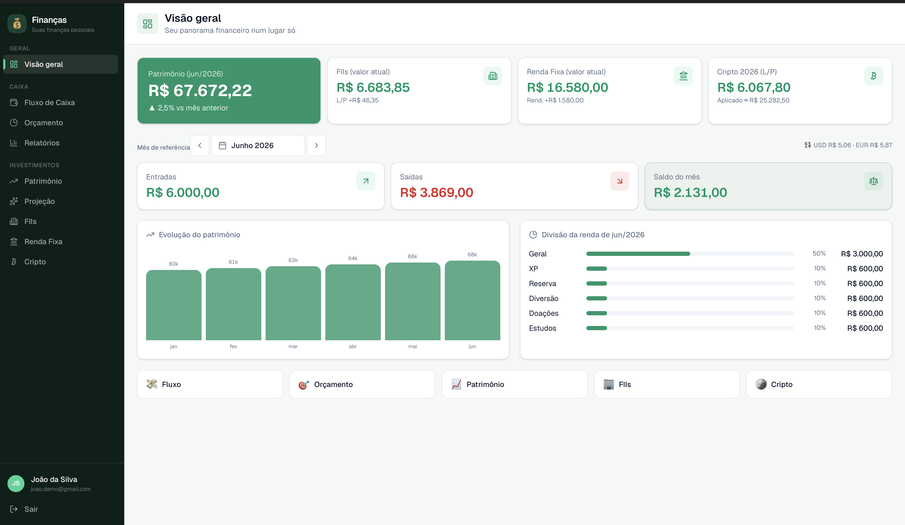
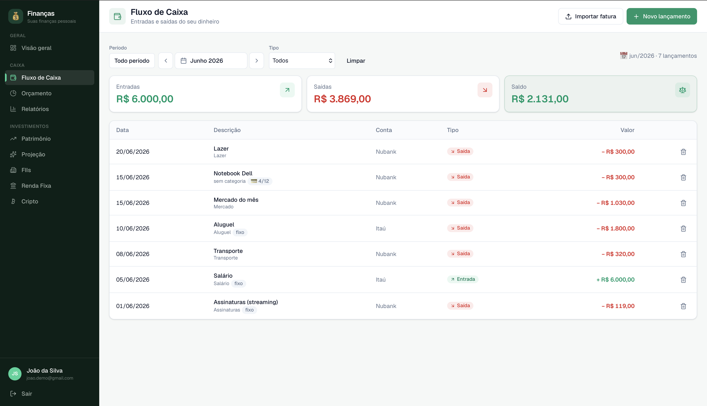
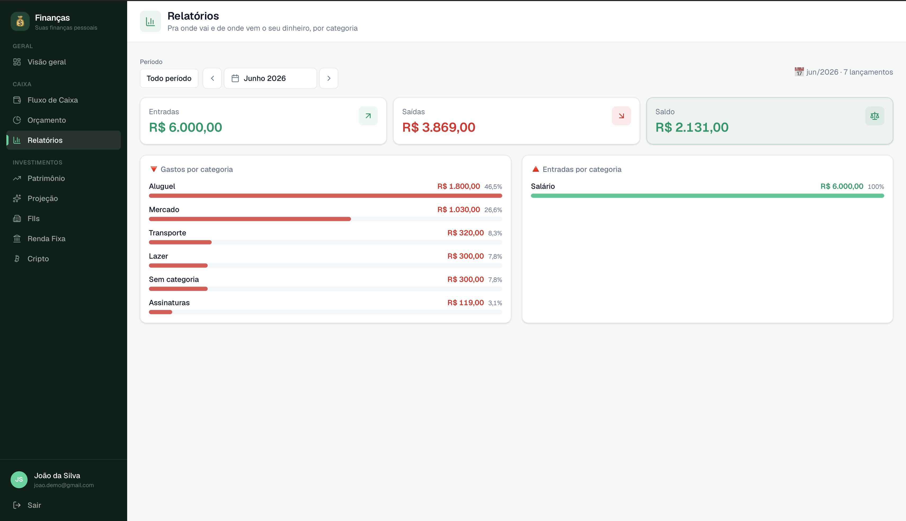
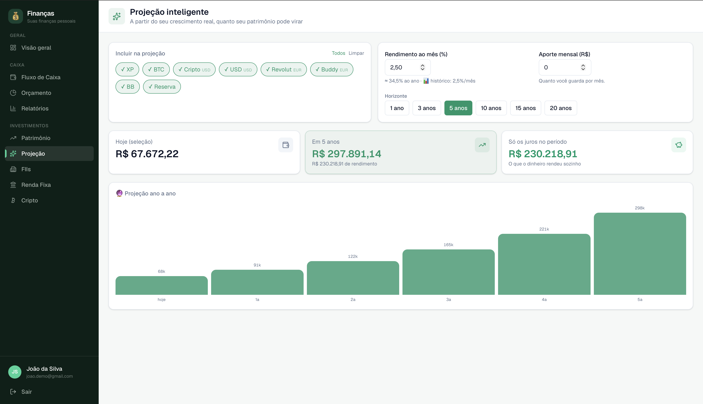
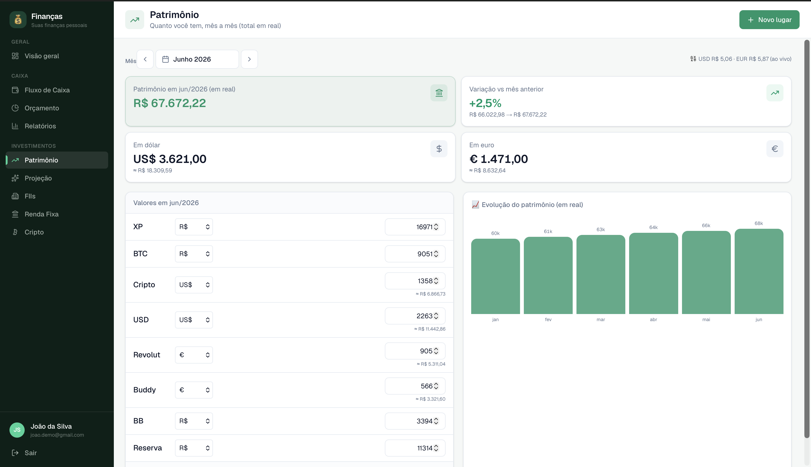
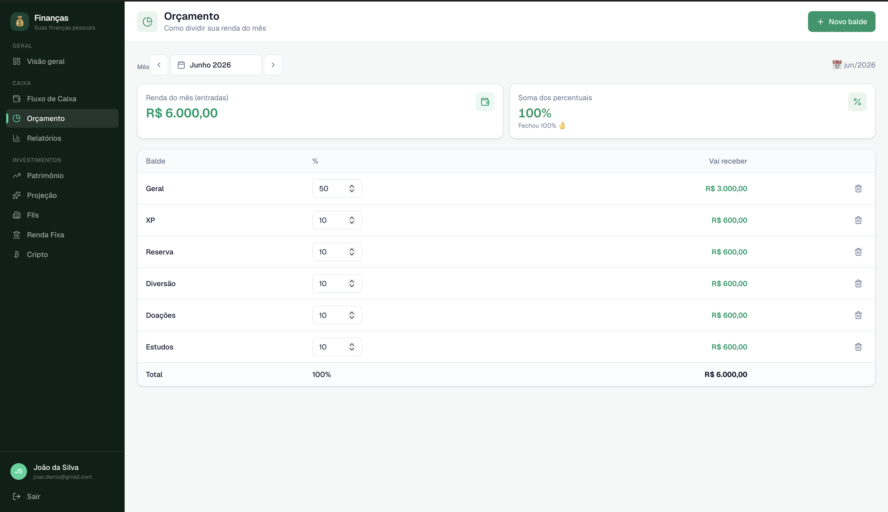

# 💰 Finanças Pessoais

App **multi-tenant** de finanças pessoais: fluxo de caixa, orçamento, patrimônio e investimentos num só lugar — cada usuário com seus dados totalmente isolados.

Construído como projeto de estudo de **backend** (por alguém que vem do **QA/front-end**), com foco em arquitetura em camadas, validação ponta a ponta e segurança por **Row Level Security**.

> 🔐 **Acesso fechado:** a instância publicada **não permite criar novos usuários** (signup desligado no Supabase) — é de uso pessoal. Para explorar o app rodando localmente, use `npm run seed:demo`, que cria o usuário **"João da Silva"** (`joao.demo@gmail.com` / `demo123456`) com dados fictícios — via API admin, funciona mesmo com o cadastro bloqueado.

## ✨ Funcionalidades

- **💸 Fluxo de Caixa** — entradas/saídas, filtro por mês, **compras parceladas** (1 lançamento por mês, agrupados) e import de fatura **OFX/CSV** sem duplicar.
- **🎯 Orçamento** — divide a renda do mês em baldes (estilo 50/10/10), com soma de percentuais.
- **📈 Patrimônio** — foto mensal por lugar, **multi-moeda** (BRL/USD/EUR) com cotação ao vivo, e gráfico de evolução.
- **🔮 Projeção** — projeta o patrimônio futuro com juros compostos: rendimento **% ao mês** + aporte fixo, filtrando por tipo de investimento, horizonte de 1 a 20 anos.
- **🏢 FIIs** — carteira com cotação ao vivo (Yahoo Finance, sem token).
- **🏦 Renda Fixa** e **🪙 Cripto** — posições, rendimento e detalhamento.

## 📸 Telas

> Capturas com dados **fictícios** (usuário de demonstração).

| Visão geral | Fluxo de Caixa |
|---|---|
|  |  |

| Relatórios (gastos por categoria) | Projeção |
|---|---|
|  |  |

| Patrimônio | Orçamento |
|---|---|
|  |  |

## 🛠️ Stack

- **Next.js 16** (App Router) + **React 19** + **TypeScript** — monolito
- **Supabase** — Postgres + Auth (cookies via `@supabase/ssr`) + **RLS**
- **Tailwind 4** (design tokens via `@theme`) + componentes estilo shadcn
- **Zod** (validação) · **Vitest** (testes das funções puras)

## 🧱 Arquitetura

Cada módulo segue a mesma trilha, do banco ao front:

```
migration (SQL + RLS)  →  schema (Zod)  →  repo (única camada de DB)
   →  service (regra de negócio, carimba o tenant)  →  rota (/api)  →  client (React)
```

- **Cálculos puros** ficam em arquivos `*.calc.ts` — rodam **igual no back e no front** (ex.: preview de parcelas e projeção no navegador, sem ida ao servidor) e são **testados** com Vitest.
- O **repo nunca filtra por tenant** — quem isola é o **RLS** no banco.

## 🔒 Multi-tenancy & segurança

- Cada usuário = 1 **tenant**, provisionado automaticamente quando a conta é criada (gatilho `handle_new_user`).
- **Cadastro fechado:** novos signups estão **desativados** na instância publicada — contas são criadas só pelo dono (painel/admin). O suporte a multi-tenant é da arquitetura; o uso é pessoal.
- Toda tabela tem **RLS ligado** + políticas `tenant_id = current_tenant_id()`. Usuário só enxerga o que é seu; deslogado não acessa nada.
- A chave `service_role` vive **só no servidor** (nunca no bundle do cliente, nunca no git).

## 🚀 Rodando localmente

```bash
# 1. dependências
npm install

# 2. variáveis de ambiente (crie um projeto no Supabase e preencha)
#    NEXT_PUBLIC_SUPABASE_URL, NEXT_PUBLIC_SUPABASE_ANON_KEY, SUPABASE_SERVICE_ROLE_KEY
#    em um arquivo .env.local

# 3. migrations (no SQL Editor do Supabase, ou via psql)
#    aplique os arquivos em supabase/migrations/ em ordem

# 4. usuário + dados de demonstração (como o cadastro é fechado, é assim
#    que se cria o login pra testar): joao.demo@gmail.com / demo123456
npm run seed:demo

# 5. sobe o app e entre com o login do demo
npm run dev
```

### Scripts úteis

| Comando | O quê |
|---|---|
| `npm run dev` | sobe em modo desenvolvimento |
| `npm test` | roda os testes (Vitest) |
| `npm run build` | build de produção |
| `npm run seed:demo` | cria o usuário demo (login + dados fictícios) via admin |
| `npm run backup` | dump do banco (`pg_dump`) |

---

Feito com 💚 como estudo de backend. Não é recomendação de investimento.
